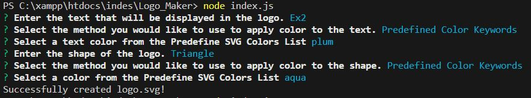
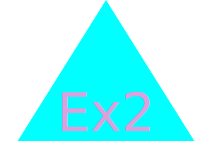
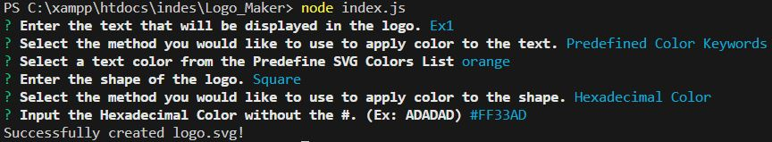
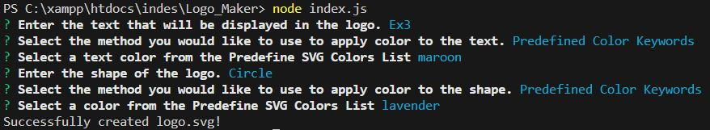

# Logo_Maker
10 Challenge
## Description
The objective of this challenge is to enhance our skills in utilizing object-oriented programming (OOP) concepts while incorporating the `Inquirer` package to collect user input from the command line. By leveraging the information gathered through Inquirer, we will dynamically create objects based on the provided parameters, which are: text, text color, shape, and shape color.

### User Story

```md
AS a freelance web developer
I WANT to generate a simple logo for my projects
SO THAT I don't have to pay a graphic designer
```

## Acceptance Criteria

```md
GIVEN a command-line application that accepts user input
WHEN I am prompted for text
THEN I can enter up to three characters
WHEN I am prompted for the text color
THEN I can enter a color keyword (OR a hexadecimal number)
WHEN I am prompted for a shape
THEN I am presented with a list of shapes to choose from: circle, triangle, and square
WHEN I am prompted for the shape's color
THEN I can enter a color keyword (OR a hexadecimal number)
WHEN I have entered input for all the prompts
THEN an SVG file is created named `logo.svg`
AND the output text "Generated logo.svg" is printed in the command line
WHEN I open the `logo.svg` file in a browser
THEN I am shown a 300x200 pixel image that matches the criteria I entered
```
## Code Snippets
### Overall functionality


## Generated SVG File (examples)

### Triangle Generation Prompt

### SVG


### Square Generation Prompt

### SVG


### Circle Generation Prompt

### SVG


## Video
]()
