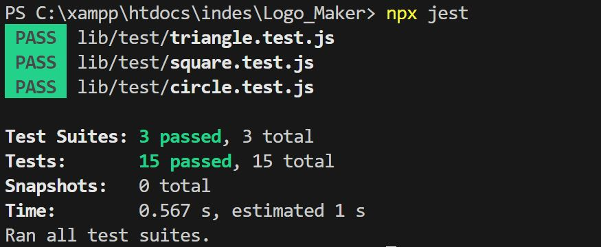
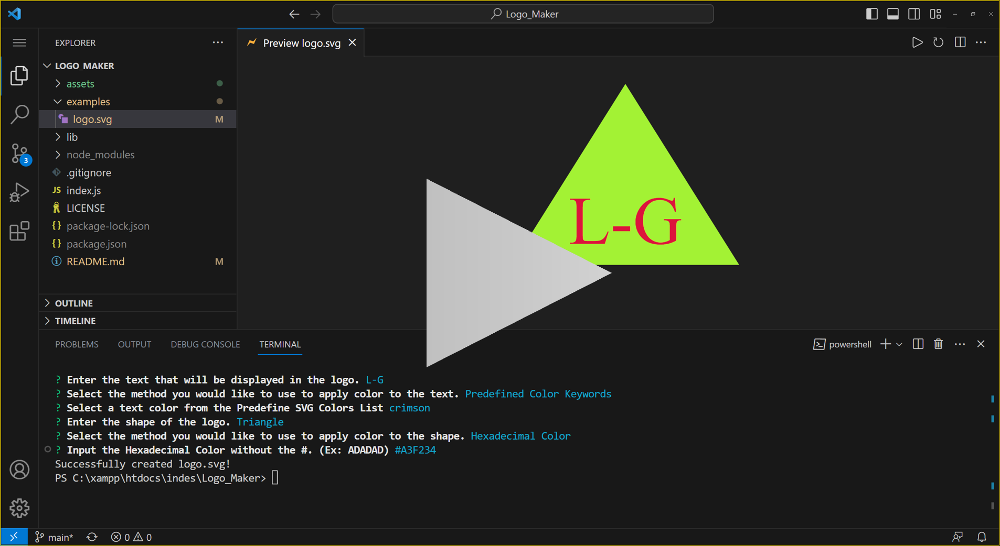

# Logo_Maker
10 Challenge
## Description
The objective of this challenge is to enhance our skills in utilizing object-oriented programming (OOP) concepts while incorporating the `Inquirer` package to collect user input from the command line. By leveraging the information gathered through Inquirer, we will dynamically create objects based on the provided parameters, which are: text, text color, shape, and shape color.

### User Story

```md
AS a freelance web developer
I WANT to generate a simple logo for my projects
SO THAT I don't have to pay a graphic designer
```

## Acceptance Criteria

```md
GIVEN a command-line application that accepts user input
WHEN I am prompted for text
THEN I can enter up to three characters
WHEN I am prompted for the text color
THEN I can enter a color keyword (OR a hexadecimal number)
WHEN I am prompted for a shape
THEN I am presented with a list of shapes to choose from: circle, triangle, and square
WHEN I am prompted for the shape's color
THEN I can enter a color keyword (OR a hexadecimal number)
WHEN I have entered input for all the prompts
THEN an SVG file is created named `logo.svg`
AND the output text "Generated logo.svg" is printed in the command line
WHEN I open the `logo.svg` file in a browser
THEN I am shown a 300x200 pixel image that matches the criteria I entered
```
## Usage
### Run the app
```
node index.js
```
### Overall functionality
The main function uses the inquirer pachage to prompt the user with a series of questions define in the question object array. The `inquirer.prompt()` method returns a promise that resolves with the user's answers. Which then the selected shape is extracted from answers object. Using the shape selected from the answers to import a module dynamically and instanciate the class, and pass the answers to the class constructor invoke the `render()` function and pass it to the `SaveSVG()` function.
```js
function init() {
    inquirer.prompt(questions).then((answers) => {
        const svgShape = require(`./lib/${answers.L_shape}`);
        const SVGContent = new svgShape(answers);
        SaveSVG(SVGContent.render());
    });
}
```
When the class constructor is imported and instantiated the answers are passed as parameters and this are sent to the Shapes inheritance which contains the variable and functions that repeats within all the shapes. The Square, Triangle, and Circle classes have two functino the returns unique values for each shape.
`renderShape()` returns the `<polygon>` element with the necessary parameters for each shape
`renderText()` returns the `<text>` element containing the texts' parameters. This is considered a unique value because to be able to allign the text within the shape is necessary to adjust the `y` value for each shape.
```js
const Shapes = require("./Shape");
class Square extends Shapes{
    constructor(info){
        super(info.L_Text, info.L_TextColor, info.L_Color);        
    }
    renderShape(){
        return `<polygon points="50,0 250,0 250,200 50,200" style="fill:${this.Color};"/>`
    }
    renderText(){
        return `<text x="50%" y="50%" dominant-baseline="middle" text-anchor="middle" fill="${this.Text_Color}" font-size="80">${this.Text}</text>`
    }    
}
```
The Shape class inherits the variable and functions the repeats within each shape: text,text color, shape color. It inherits three functions:
`setText()` this function sets the text parameters, string value and color.
`setColor()` this function sets the shapes color.
`render()` render() function outputs the content necessary for the SVG file body.
```js
class Shape{
    constructor(text,textColor, shapeColor){
        this.Text = text;
        this.Text_Color = textColor;
        this.Color = shapeColor;        
    }
    setText(text,textcolor){
        this.Text = text;
        this.Text_Color = textcolor;
    }
    SetColor(Color){
        this.Color = Color;
    }
    render(){
        return `<svg xmlns="http://www.w3.org/2000/svg" width="300" height="200">\n\t${this.renderShape()}\n\t${this.renderText()}\n</svg>`;
    }
}
```
## Test
### Run the text
```
npx jest
```
### What is Tested
For testing the differnt shape classes, 3 test.js files are used. `triangle.test.js`, `square.test.js` and `circule.test.js` are organized into different sections, each focusing on specific aspects of the class.

* `Instantiate` verifies that an instance of the Triangle class is created correctly.

* `Predefine Color Keywords` tests the setting of `shape color` and `text properties` using `predefined color keywords`. It checks whether the `setColor()` method correctly sets the shape color of the triangle and whether the `setText()` method correctly sets the text and text color.
* `Hexadecimal Color` tests the setting of `shape color` and `text properties` using **hexadecimal color codes**. It verifies that the `setColor()` method correctly sets the shape color using a **hexadecimal color code**, and the `setText()` method correctly sets the text and text color using a **hexadecimal color code**.

<sup> *This tests are repeated for each shape.

### Test Code Example
```js
describe('Triangle', () => {
    describe('Instantiate', () => {
        it('should be an instance of Triangle class', () => {
            const triangle = new Triangle(answermock);
            expect(triangle).toBeInstanceOf(Triangle);
        });
    });
    describe('Predefine Color Keywords', ()=> {
        describe('Polygon Element:\nShape Color: Red', () => {
            it('Should set shape color Values correctly', () => {
                const triangle = new Triangle(answermock);
                triangle.setColor('red');
                expect(triangle.renderShape()).toBe('<polygon points="150,0 275,200 25,200" style="fill:red;"/>');
            });
        });
        describe('Text Element:\nText: Ts1\nText Color: blue\nShape Color: Red', () => {
            it('Should set Text and text color Values correctly', () => {
                const triangle = new Triangle(answermock);
                triangle.setText('Ts1', 'blue');
                expect(triangle.renderText()).toBe('<text x="50%" y="80%" dominant-baseline="middle" text-anchor="middle" fill="blue" font-size="75">Ts1</text>');
            });
        });
    });
    describe('Hexadecimal Color', ()=> {
        describe('Polygon Element:\nShape Color: Red(FF0000)', () => {
            it('Should set shape color Values correctly', () => {
                const triangle = new Triangle(answermock);
                triangle.setColor('#FF0000');
                expect(triangle.renderShape()).toBe('<polygon points="150,0 275,200 25,200" style="fill:#FF0000;"/>');
            });
        });
        describe('Text Element:\nText: Ts2\nText Color: blue(0000FF)', () => {
            it('Should set Text and text color Values correctly', () => {
                const triangle = new Triangle(answermock);
                triangle.setText('Ts2', '#0000FF');
                expect(triangle.renderText()).toBe('<text x="50%" y="80%" dominant-baseline="middle" text-anchor="middle" fill="#0000FF" font-size="75">Ts2</text>');
            });
        });
    });
});
```
### Test Successfully Passed


## Generated SVG File (examples)
### Triangle Generation Prompt

### SVG


### Square Generation Prompt

### SVG


### Circle Generation Prompt

### SVG


## Video
[](https://1drv.ms/v/s!Asj9JhD05ulbsmX9vv-NrVazJf3s?e=akXML8)
